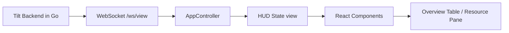

# Tilt Web UI: Rendering, Stack und Datenfluss

Diese Notiz erklärt, **wie die Tilt-Web-UI gerendert wird**, welcher Stack genutzt wird und wie die Daten in die React-Komponenten gelangen.

Siehe auch: [[Overview|Projektüberblick]]

> [!info] Kurzfassung
> Die Web-UI ist eine **React 17 + TypeScript** App (Create React App + `react-scripts`), die live Daten per **WebSocket** von Tilt bezieht (`/ws/view`) und in einer zentralen HUD-Komponente rendert.

## 1) Welcher Stack wird genutzt?

### Frontend-Basis

- **React 17** (`react`, `react-dom`)
- **TypeScript** (`typescript`)
- **Create React App / react-scripts** (Start, Build, Test)
- **Yarn 4** als Package Manager

### UI/Styling

- **Material UI v4** (`@material-ui/core`, `@material-ui/styles`)
- **styled-components** (komponentennahe Styles)
- SCSS-Dateien für globale/legacy Styles (`*.scss`)

### Routing und UX

- **react-router v6** (`BrowserRouter`, `Routes`, `Route`)
- **react-modal**, **notistack**, weitere UI-Helfer

### Build/Test Storybook

- `react-scripts build/test`
- Storybook 6 für isolierte Komponentenentwicklung

> [!note] Quelle
> Abgeleitet aus `web/package.json`.

## 2) Wo startet das Rendering?

Der Einstieg liegt in `web/src/index.tsx`:

1. `ReactModal.setAppElement("#root")`
2. `BrowserRouter` wird initialisiert
3. `InterfaceVersionProvider` wird um die App gelegt
4. `HUDFromContext` wird gerendert
5. `ReactDOM.render(app, root)` mounted in `#root`

Das heißt: **HUD** ist die Top-Level-UI für den eigentlichen App-Inhalt.

## 3) Wie kommt der State in die UI?

> [!important] Kernprinzip
> Die UI wird primär aus einem `view`-Objekt gerendert, das von Tilt live geliefert wird.

### Live-Mode (normal)

In `web/src/AppController.ts` passiert Folgendes:

- Holt zuerst ein CSRF-Token über `fetch("/api/websocket_token")`
- Öffnet dann WebSocket auf `ws://.../ws/view` oder `wss://.../ws/view`
- Empfängt JSON-Nachrichten
- Parsed sie zu `View`
- Aktualisiert HUD-State mit `onAppChange({ view, socketState: Active })`

Wenn die Verbindung fällt, nutzt der Controller Exponential Backoff und reconnectet automatisch.

### Snapshot-Mode

Wenn URL auf `/snapshot/<id>` passt, wird statt WebSocket ein Snapshot per HTTP geladen (`/api/snapshot/<id>`).

## 4) Welche Komponenten rendern was?

In `web/src/HUD.tsx`:

- HUD erstellt `PathBuilder` + `AppController`
- `componentDidMount()` startet WebSocket oder Snapshot-Laden
- Bei fehlenden Ressourcen: `HeroScreen` mit "Loading..."
- Danach wird die eigentliche Overview gerendert

Routing innerhalb der HUD:

- `/r/:name/overview` -> `OverviewResourcePane` (einzelne Ressource)
- `*` -> `OverviewTablePane` (Tabellen-Overview)

Viele Context-Provider kapseln Features wie:

- Resource Navigation
- Resource Selection
- Snapshot Actions
- LogStore
- Sidebar State

## 5) Datenmodell für Rendering

Die Typen in `web/src/webview.d.ts` zeigen die Payload-Struktur.

Wichtige Felder im `View`:

- `uiSession`
- `uiResources`
- `uiButtons`
- `logList`
- `isComplete` (vollständiger Zustand vs. Delta)

Damit ist die UI weitgehend **server-driven**: Das Backend bestimmt den Zustand, die Frontend-Komponenten visualisieren ihn.

## 6) Wie passt das zum Go-Backend?

`web/web.go` liefert den Pfad zu den statischen Web-Assets und validiert, dass `package.json` vorhanden ist.
Das zeigt: die Web-App ist fester Bestandteil des Tilt-Repos und wird vom Go-System eingebunden.

## 7) Mentales Modell

> [!tip] Praktischer Lernweg
> Lies zuerst `web/src/index.tsx`, dann `web/src/HUD.tsx`, danach `web/src/AppController.ts`.
> Anschließend in `OverviewTablePane.tsx` verfolgen, wie `view` konkret in sichtbare UI umgesetzt wird.

## Weiterführende Links

- Extern: [React](https://react.dev)
- Extern: [React Router](https://reactrouter.com)
- Extern: [Material UI](https://mui.com/material-ui/getting-started/overview/)
- Extern: [Styled Components](https://styled-components.com/docs)
